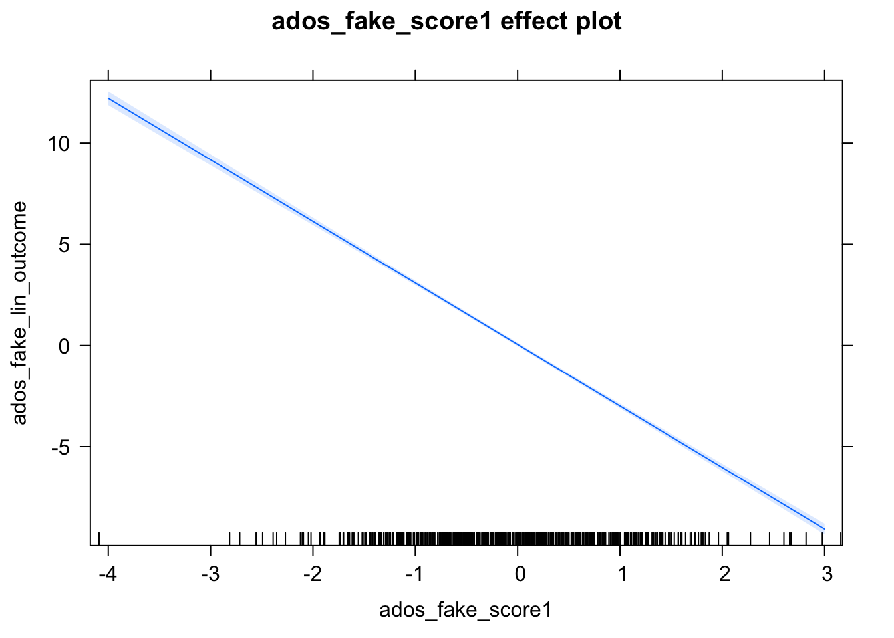

## Basic Stats functions

### Mean, Median, Standard Deviation, Summary

```r
mean(cars$speed, na.rm = TRUE)
```

```
## [1] 15.4
```

```r
median(cars$dist, na.rm = TRUE)
```

```
## [1] 36
```

```r
sd(cars$speed, na.rm = TRUE)
```

```
## [1] 5.287644
```

```r
summary(cars)
```

```
##      speed           dist       
##  Min.   : 4.0   Min.   :  2.00  
##  1st Qu.:12.0   1st Qu.: 26.00  
##  Median :15.0   Median : 36.00  
##  Mean   :15.4   Mean   : 42.98  
##  3rd Qu.:19.0   3rd Qu.: 56.00  
##  Max.   :25.0   Max.   :120.00
```

## Linear Regression

- We will use the mtcars dataset for these examples

### Correlation

- Find correlation between two vars

```r
cor.test(mtcars$wt, mtcars$disp)
```

```
## 
## 	Pearson's product-moment correlation
## 
## data:  mtcars$wt and mtcars$disp
## t = 10.576, df = 30, p-value = 1.222e-11
## alternative hypothesis: true correlation is not equal to 0
## 95 percent confidence interval:
##  0.7811586 0.9442902
## sample estimates:
##       cor 
## 0.8879799
```

### Creating a Linear Model

```r
linearMod <-lm(dist ~ speed, cars)
print(linearMod)
```

```
## 
## Call:
## lm(formula = dist ~ speed, data = cars)
## 
## Coefficients:
## (Intercept)        speed  
##     -17.579        3.932
```

### Plotting the Linear Model

```r
# create effects object
eff <- effects::Effect('speed', linearMod)
eff
```

```
## 
##  speed effect
## speed
##        4      9.2       14       20       25 
## -1.84946 18.59907 37.47463 61.06908 80.73112
```

```r
plot(eff)
```


## Logistic Regression


```r
adosm1$ASD_risk <- as.factor(adosm1$recruitment_group == 'ASD risk')
adosm1$sarb_f <- as.factor(adosm1$ados_sarb_total)
adosm1$gender_factor <- as.factor(adosm1$gender)
adosm1$recruitment_group_f <- as.factor(adosm1$recruitment_group)
logMod <- 
  glm(ASD_risk ~ sarb_f +  gender_factor,
      adosm1, family = 'binomial')
logMod
```

```
## 
## Call:  glm(formula = ASD_risk ~ sarb_f + gender_factor, family = "binomial", 
##     data = adosm1)
## 
## Coefficients:
##       (Intercept)            sarb_f1            sarb_f2  
##           -0.3815             0.1500             0.2267  
##           sarb_f3            sarb_f4            sarb_f5  
##            0.8868             1.1712             1.5137  
##           sarb_f6            sarb_f7            sarb_f8  
##            1.5840             0.6224             1.1274  
##           sarb_f9           sarb_f10           sarb_f11  
##            2.6826             1.8771             0.7671  
##          sarb_f12           sarb_f13           sarb_f14  
##            1.1296             3.2461             2.0244  
##          sarb_f15           sarb_f16           sarb_f17  
##            2.0005             1.1525             1.6009  
##          sarb_f18           sarb_f19           sarb_f20  
##            1.6125             0.4841            17.1203  
##          sarb_f21           sarb_f22           sarb_f23  
##            2.3623           -16.1846            16.9476  
##          sarb_f24           sarb_f25           sarb_f26  
##            0.4669            16.9476            17.2042  
## gender_factormale  gender_factorMale  
##           15.9578            -0.2566  
## 
## Degrees of Freedom: 1010 Total (i.e. Null);  982 Residual
##   (13 observations deleted due to missingness)
## Null Deviance:	    1365 
## Residual Deviance: 1247 	AIC: 1305
```

```r
plot(effects::Effect(c('sarb_f', 'gender_factor'), logMod))
```




## Mixed Effects Models

## Plotting with effects

## Plotting with ggplot

## More Resources

