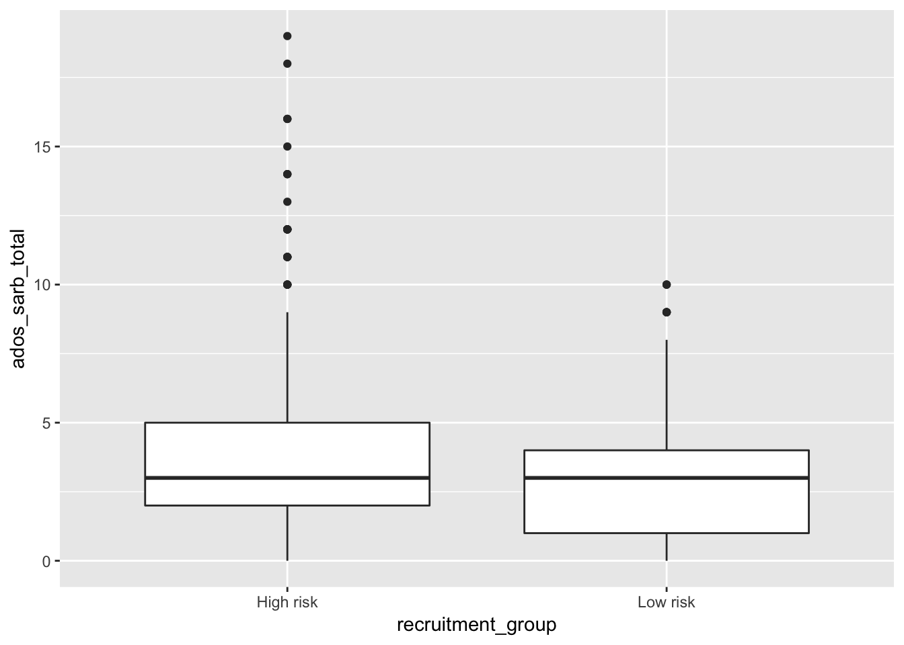

# Data Visualization

- We will use the ggplot2 library for data visualization


```r
library("ggplot2")
# if not installed:
# install.packages("ggplot2")
```

## Read in Data

- Our input data will be a scored version of the artificial ADOS Module 2dataset with some fake columns to demonstrate how to use R to perform specific data analyses.


```r
adosm2 <- read.csv('./datasets/adosm2_scored.csv', 
                   stringsAsFactors = FALSE)
```

## Our dataset

```r
head(adosm2)
```

```
##   id visit cbe_36 recruitment_group gender ados_version     ados_algorithm
## 1  1    36     TD         High risk Female       ADOS-2 younger than age 5
## 2  2    30 Non-TD         High risk Female       ADOS-1 younger than age 5
## 3  2    36 Non-TD          Low risk   Male       ADOS-2 younger than age 5
## 4  3    36     TD          Low risk   Male       ADOS-1 younger than age 5
## 5  4    36    ASD         High risk Female       ADOS-2 younger than age 5
## 6  5    36    ASD         High risk   Male       ADOS-1 younger than age 5
##   ados_a1 ados_a2 ados_a3 ados_a4 ados_a5 ados_a6 ados_a7 ados_a8 ados_b1
## 1       0       0       2       1       0       0       1      NA       0
## 2       1       1       0       0       0       2       0       0       0
## 3       0       0       0       0       0       0       1      NA       0
## 4       1       1       1       0       0       0       1       1       0
## 5       1       2       2       1       2       1       1      NA       2
## 6       1       2       1       1       1       2       1       0       0
##   ados_b2 ados_b3 ados_b4 ados_b5 ados_b6 ados_b7 ados_b8 ados_b9 ados_b10
## 1       1       0       0       0       0       0       0      NA        0
## 2       0       0       0       0       0       0       1       0        0
## 3       0       0       0       0       0       0       1      NA        1
## 4       0       0       0       1       0       0       0       0        0
## 5       1       0       0       0       0       0       2      NA        2
## 6       1       0       1       0       1       0       1       1        1
##   ados_b11 ados_b12 ados_b13a ados_b13b ados_b14 ados_b15 ados_b16 ados_c1
## 1        0        0        NA        NA       NA       NA       NA       0
## 2        0       NA        NA        NA       NA       NA       NA       0
## 3        0        0        NA        NA       NA       NA       NA       1
## 4        0       NA        NA        NA       NA       NA       NA       0
## 5        0        2        NA        NA       NA       NA       NA       0
## 6        1       NA        NA        NA       NA       NA       NA       0
##   ados_c2 ados_d1 ados_d2 ados_d3 ados_d4 ados_e1 ados_e2 ados_e3
## 1       1       0       0       0       0       1       0       0
## 2       0       0       1       0      NA       0       0       1
## 3       0       0       1       0       0       0       1       0
## 4       0       0       0       0       0       0       0       0
## 5       1       0       0       0       1       0       0       0
## 6       0       0       0       0       1       0       0       0
##   ados_module ados_sa_total ados_rrb_total ados_sarb_total
## 1    module 2             2              1               3
## 2    module 2             1              1               2
## 3    module 2             2              1               3
## 4    module 2             3              0               3
## 5    module 2             9              2              11
## 6    module 2             6              2               8
##   ados_fake_score1 ados_fake_score2 ados_fake_score3 ados_fake_lin_outcome
## 1      -1.06513001      0.998584320       -0.9534730              6.059116
## 2      -0.23353777      0.900076820        0.7804324              3.730527
## 3      -1.15568143      0.012777153        0.8189690              3.586971
## 4       0.07780154     -0.711836888        0.5982869             -3.078532
## 5       0.83883085     -0.002801434        0.7559831             -3.548941
## 6       0.79487178     -2.205095309       -0.5817975             -7.756788
```

## Data Visualization with `ggplot`

### Resources

- This lesson largely borrowed and used the material in this book:
- [R for Data Science](https://r4ds.had.co.nz/)

- Explore Chapter 3 of the book for a much more in depth lesson

### Plotting points

```r
library("ggplot2")
ggplot(data = adosm2) + 
  geom_point(mapping = aes(x = ados_fake_lin_outcome, 
                           y = ados_sarb_total, 
                           color = recruitment_group))
```


- `ggplot()` will create a coordinate system you can add layers on top of
    - it takes in the dataset to use in the graph with the `data` parameter
- `geom_point()` is the extra layer we are adding on the coordinate system, so we are adding points to it
    - the `mapping` argument will define how variables in your data will be **mapped** to a visual property
        - The `aes()` argument within marks what piece of your dataset will map to the x or y axes, or even colors or fills.

### Plotting with Points and Smooth


```r
ggplot(data = adosm2, mapping = aes(x = ados_sarb_total, y = ados_fake_lin_outcome)) + 
  geom_point(mapping = aes(color = recruitment_group)) + 
  geom_smooth()
```

```
## `geom_smooth()` using method = 'loess' and formula 'y ~ x'
```


- We can plot points  with a smooth line by adding another layer with `+ geom_smooth()`.
- In this example, the first layer takes in our adosm2 dataset, and maps the ados_sarb_total to the x axes,and the ados_fake_lin_outcome to the y axes
- The second layer plots points using the mapping of the first layer, but in addition adds color to the points by recruitment group
- The third layer uses the mapping of the first layer, so does not need any additional arguments

- We can similarly create bar plots and box plots using the same syntax, but with `geom_bar()` and `geom_boxplot()`


### Bar Plots

#### Bar plot with Colors

```r
ggplot(data = adosm2) + 
  geom_bar(mapping = aes(x = recruitment_group, fill = gender))
```


#### Bar plot with separated colors and positions

```r
ggplot(data = adosm2) + 
  geom_bar(mapping = aes(x = recruitment_group, fill = gender), position = "dodge")
```


### Box Plots


```r
ggplot(data = adosm2, mapping = aes(x = recruitment_group, y = ados_sarb_total)) +
  geom_boxplot()
```



## Template for graphing


```text
ggplot(data = <DATA>) + 
  <GEOM_FUNCTION>(mapping = aes(<MAPPINGS>))
```

- You can search what other geom function are available by following the links on your help page:

- `?ggplot2`
