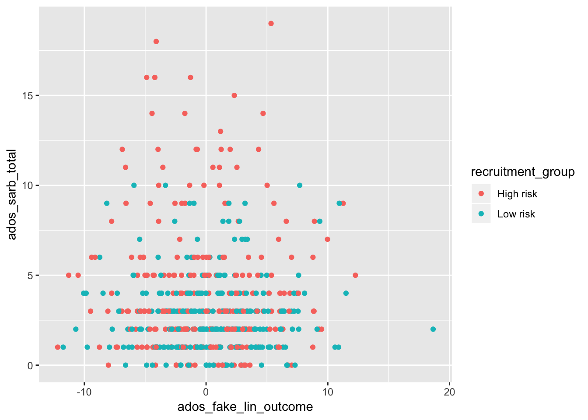
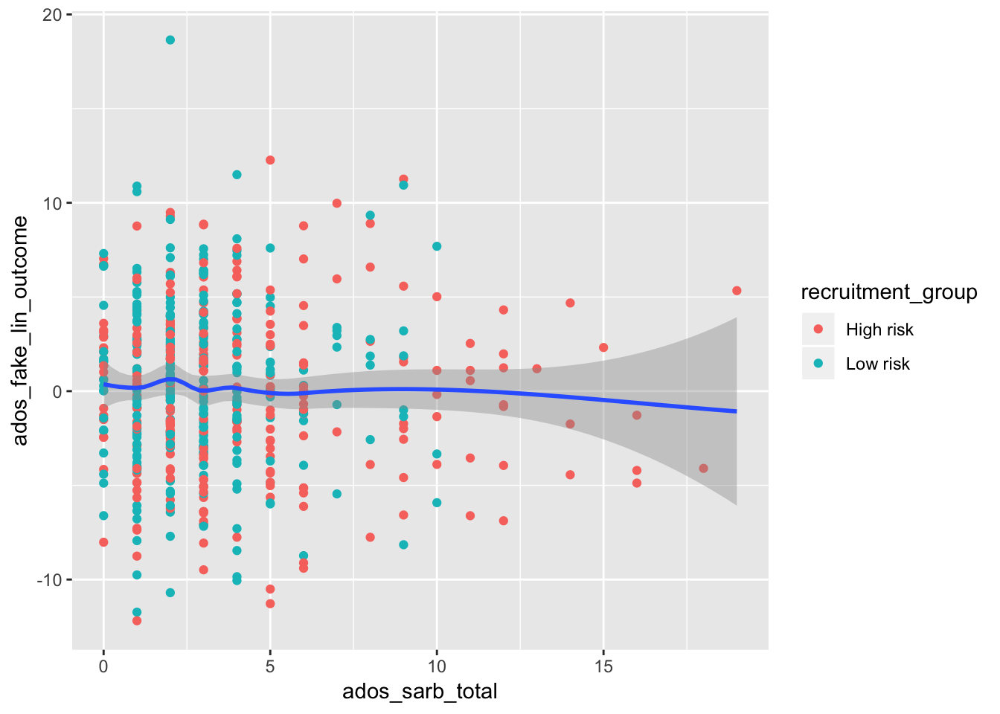
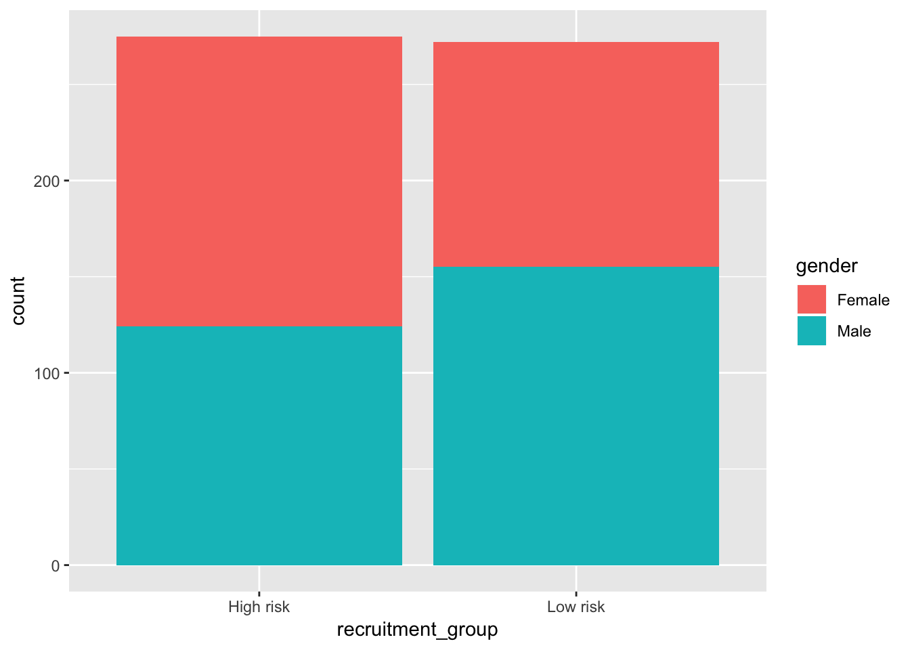
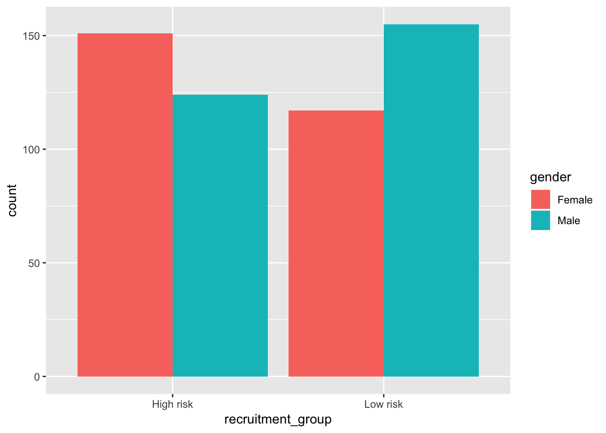

# Data Visualization

## Read in Data

- Our input data will be a scored version of the artificial ADOS Module 2dataset with some fake columns to demonstrate how to use R to perform specific data analyses.


```r
adosm2 <- read.csv('./datasets/adosm2_scored.csv', 
                   stringsAsFactors = FALSE)
```

## Data Visualization with `ggplot`

### Plotting points

```r
library(ggplot2)
ggplot(data = adosm2) + 
  geom_point(mapping = aes(x = ados_fake_lin_outcome, 
                           y = ados_sarb_total, 
                           color = recruitment_group))
```



### Plotting with Points and Smooth


```r
ggplot(data = adosm2, mapping = aes(x = ados_sarb_total, y = ados_fake_lin_outcome)) + 
  geom_point(mapping = aes(color = recruitment_group)) + 
  geom_smooth()
```

```
## `geom_smooth()` using method = 'loess' and formula 'y ~ x'
```



### Bar Plots

#### Bar plot with Colors

```r
ggplot(data = adosm2) + 
  geom_bar(mapping = aes(x = recruitment_group, fill = gender))
```



#### Bar plot with separated colors and positions

```r
ggplot(data = adosm2) + 
  geom_bar(mapping = aes(x = recruitment_group, fill = gender), position = "dodge")
```



### Box Plots


```r
ggplot(data = adosm2, mapping = aes(x = recruitment_group, y = ados_sarb_total)) +
  geom_boxplot()
```


