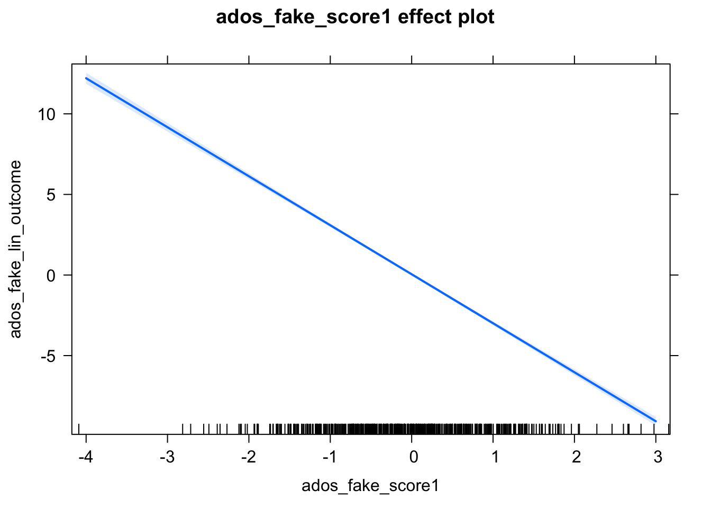
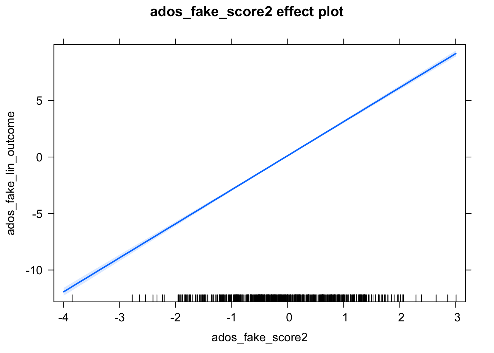

# Data Analysis

## Read in Data

- Our input data will be a scored version of the artificial ADOS Module 2dataset with some fake columns to demonstrate how to use R to perform specific data analyses.


```r
adosm2 <- read.csv('./datasets/adosm2_scored.csv', 
                   stringsAsFactors = FALSE)
```


## Basic Stats functions

### Mean, Median, Standard Deviation, Summary

```r
mean(adosm2$ados_sarb_total, na.rm = TRUE)
```

```
## [1] 3.488117
```

```r
median(adosm2$ados_sarb_total, na.rm = TRUE)
```

```
## [1] 3
```

```r
sd(adosm2$ados_sarb_total, na.rm = TRUE)
```

```
## [1] 3.02392
```

```r
summary(adosm2$ados_sarb_total)
```

```
##    Min. 1st Qu.  Median    Mean 3rd Qu.    Max. 
##   0.000   1.500   3.000   3.488   4.000  19.000
```

### Chi Squared Test


```r
chisq.test(table(adosm2$cbe_36, adosm2$recruitment_group))
```

```
## Warning in chisq.test(table(adosm2$cbe_36, adosm2$recruitment_group)): Chi-
## squared approximation may be incorrect
```

```
## 
## 	Pearson's Chi-squared test
## 
## data:  table(adosm2$cbe_36, adosm2$recruitment_group)
## X-squared = 15.284, df = 4, p-value = 0.004147
```

## Linear Regression

### Correlation

- Find correlation between two vars

```r
cor.test(adosm2$ados_fake_score1, adosm2$ados_fake_lin_outcome)
```

```
## 
## 	Pearson's product-moment correlation
## 
## data:  adosm2$ados_fake_score1 and adosm2$ados_fake_lin_outcome
## t = -22.232, df = 545, p-value < 2.2e-16
## alternative hypothesis: true correlation is not equal to 0
## 95 percent confidence interval:
##  -0.7311983 -0.6429767
## sample estimates:
##        cor 
## -0.6896378
```

### Creating a Linear Regression Model

- We use the `lm()` functionn to create a Linear Regression Model
- The first parameter takes in an equation of the form: `dependentVar ~ predictor1 + predictor2 + ...`
    - So the dependentVar is a function of the predictor variables
- In order to use column names as variables in this eq., the `data` parameter takes in a dataframe as input.


```r
# To demonstrate a linear model, we use fake ados columns within the ados
# dataframe
linearMod <- 
  lm(ados_fake_lin_outcome ~ ados_fake_score1 + ados_fake_score2,
     data=adosm2)
```
### Residuals, P-Values, Coefficients, with `summary()`


```r
summary(linearMod)
```

```
## 
## Call:
## lm(formula = ados_fake_lin_outcome ~ ados_fake_score1 + ados_fake_score2, 
##     data = adosm2)
## 
## Residuals:
##      Min       1Q   Median       3Q      Max 
## -2.75987 -0.68070  0.04043  0.65436  3.11995 
## 
## Coefficients:
##                  Estimate Std. Error t value Pr(>|t|)    
## (Intercept)       0.01635    0.04233   0.386      0.7    
## ados_fake_score1 -3.04059    0.04225 -71.970   <2e-16 ***
## ados_fake_score2  3.01164    0.04292  70.176   <2e-16 ***
## ---
## Signif. codes:  0 '***' 0.001 '**' 0.01 '*' 0.05 '.' 0.1 ' ' 1
## 
## Residual standard error: 0.9894 on 544 degrees of freedom
## Multiple R-squared:  0.9478,	Adjusted R-squared:  0.9476 
## F-statistic:  4942 on 2 and 544 DF,  p-value: < 2.2e-16
```


### Plotting the Linear Model

```r
# create effects object
plot(effects::Effect(c('ados_fake_score1'), linearMod))
```



```r
plot(effects::Effect(c('ados_fake_score2'), linearMod))
```



```r
plot(effects::Effect(c('ados_fake_score1', 'ados_fake_score2'), linearMod))
```


## Logistic Regression


```r
adosm2$cbe_asd <- ifelse(adosm2$cbe_36 %in% c('Autism', 'ASD'), 'ASD', 'Non-ASD')
adosm2$cbe_asd <- as.factor(adosm2$cbe_asd)
adosm2$cbe_asd <- relevel(adosm2$cbe_asd, ref = 'Non-ASD')
mod <- glm(cbe_asd ~ 1 + ados_sarb_total,
                   data = adosm2,
                   family = 'binomial')
eff <- effects::Effect(c('ados_sarb_total'), mod)
plot(eff,
     axes = list(
       y = list(
         lab = 'CBE of ASD',
         ticks = list(at = c(.01, .1, .2, .4, .6, .8,  .99))))
)
```


## Mixed Effects Models

### Mixed Effects Logistic Regression


```r
# analyze- logistic regression mixed effects
adosm2$cbe_asd <- ifelse(adosm2$cbe_36 %in% c('Autism', 'ASD'), 'ASD', 'Non-ASD')
adosm2$cbe_asd <- as.factor(adosm2$cbe_asd)
adosm2$cbe_asd <- relevel(adosm2$cbe_asd, ref = 'Non-ASD')
mod <- lme4::glmer(cbe_asd ~ 1 + (1|visit) + ados_sarb_total,
                   data = adosm2,
                   family = 'binomial')
eff <- effects::Effect(c('ados_sarb_total'), mod)
plot(eff,
     axes = list(
       y = list(
         lab = 'CBE of ASD',
         ticks = list(at = c(.01, .1, .2, .4, .6, .8,  .99))))
)
```


